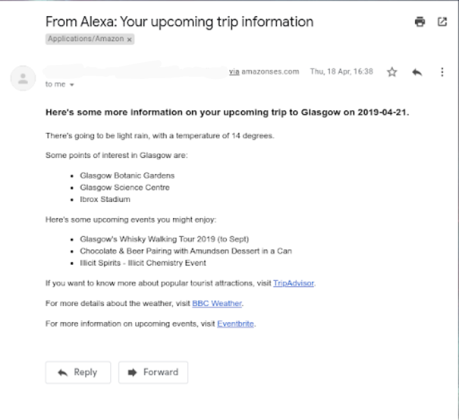
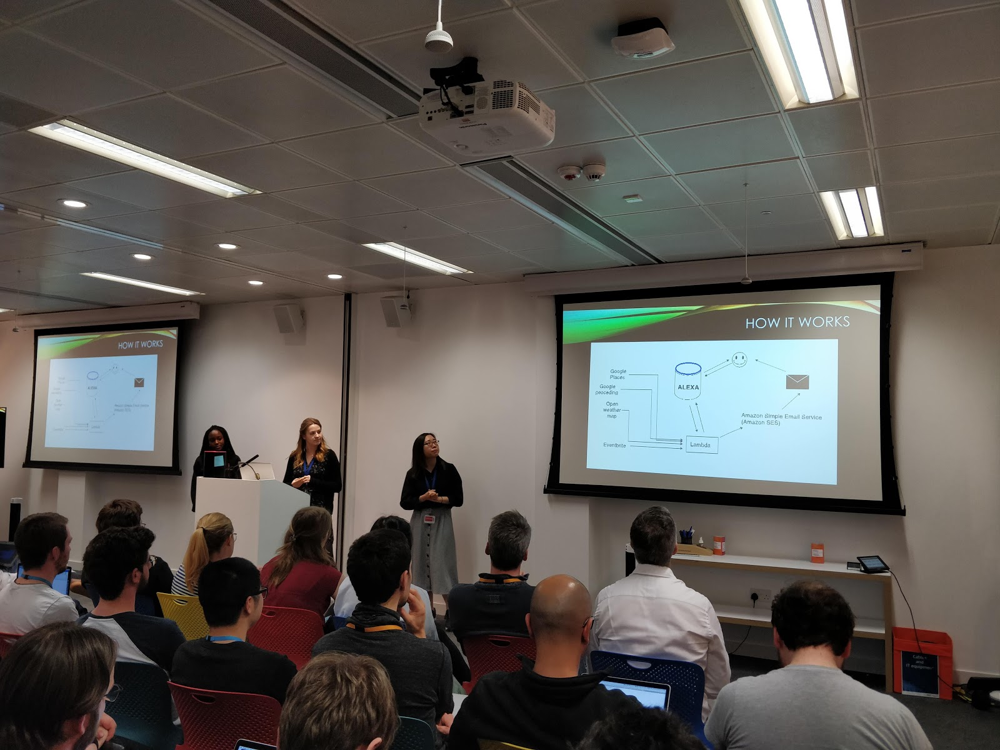

# Asking for Travel

## What is it?

Asking for Travel is an Alexa skill that was created as part of a three day hackathon at Amazon's Development Centre Scotland in April 2019. The idea is that the user would like to visit a city and wants to find out more about the destination.

## How does it work?

The user tells Alexa where they are going and when, mentioning a specific interest of theirs (such as music, football, or history). The skill returns information about the weather during the trip, the top tourist attractions in the city, and any upcoming events that might be of interest. A snippet of this information is returned as speech, and then the user is sent an email with more detailed information for them to review later.

## Example

2019-04-21

*User*: Tell Asking for Travel I'm going to Glasgow on the 21st April and I’m interested in alcohol

*Alexa*: The weather is going to be rainy and tourists who travel to Glasgow often like to visit the Botanic Gardens or the Science Centre. Also, there’s an upcoming event you might be interested in: Glasgow's Whisky Walking Tour. I’ll send you an email with some more detailed information!

## Technologies

We used five APIs: Eventbrite for the upcoming local events, Google Places for the top attractions, Google Geocoding to convert a city name to a latitude and longitude, Open Weather Map for the weather and Amazon's SES to send the emails.

## Pitch

We pitched our skill to Amazon employees on the final day.

